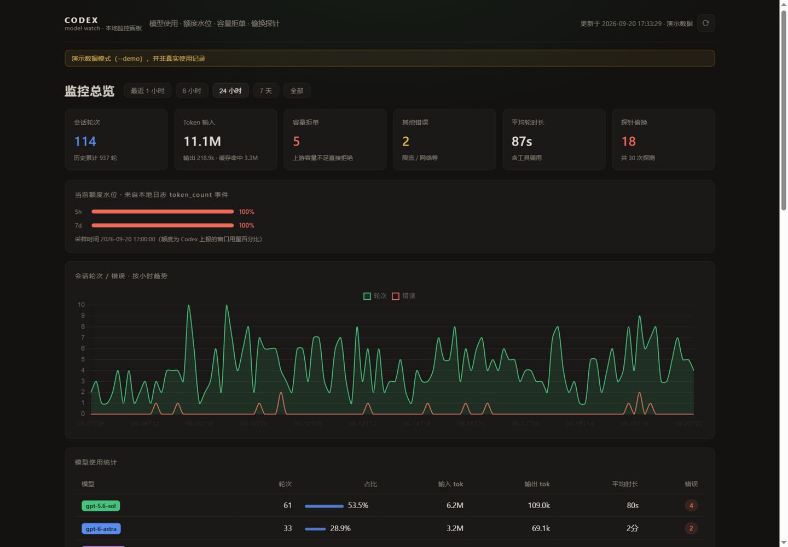
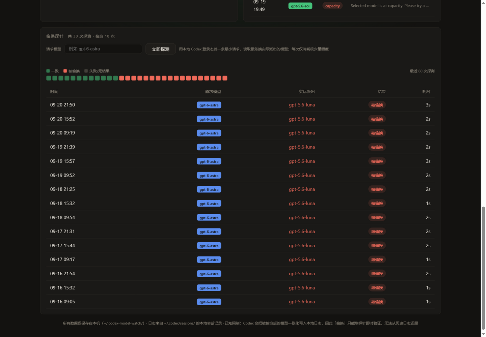

# codex-model-watch

[中文](README.md) | **English**

A fully local dashboard for Codex: model usage, 5h/7d quota windows, capacity rejections — plus an active probe that catches silent model swaps (you asked for A, the server served B). Pure Python stdlib, 100% local.

A fully local, zero-dependency tool that monitors your Codex **model usage, rate-limit windows, capacity rejections**, and **actively probes for silent model swaps** — you asked for model A, the server actually served model B.



## Background: what is a "model swap"

When OpenAI runs low on capacity, it enables a *safety buffering* mechanism: you request a
premium model (e.g. `gpt-6-astra`), and the server quietly reroutes your request to a
faster/smaller model (e.g. `gpt-5.6-luna`). **The UI never tells you.** Output quality drops
noticeably and you have no idea why.

This tool turns that phenomenon into visible data.

## What it tells you

| Question | Source | Notes |
|---|---|---|
| Which models am I using, how much? | Local session logs | Effective model per turn, turns, tokens, duration, per-project breakdown |
| How much of my quota is left? | Local session logs | The 5-hour / 7-day window usage percentages reported by Codex (with reset times) |
| How many capacity rejections did I hit? | Local session logs | Count and details of `Selected model is at capacity` errors |
| What do I get *right now* if I request X? | **Active probe** | Sends one minimal request and reads the model the server actually dispatched |
| How often have I been swapped historically? | Probe history | Every probe records requested → served, plus an overall swap rate |

## How it works (read this first)

The tool has two independent data channels:

### 1. Local session logs (non-invasive, zero quota cost, full history)

Codex writes every conversation turn to local files:

```
~/.codex/sessions/YYYY/MM/DD/rollout-*.jsonl
```

Each line is a JSON event. The tool incrementally parses four kinds of them:

| Event | What it provides |
|---|---|
| `turn_context` | The **effective** model for the turn (`payload.model`), reasoning effort, project (cwd) |
| `token_usage_record` | Per-turn token usage (input / output / cache hit) |
| `event_msg/task_complete` | Turn duration, time-to-first-token, **errors** (capacity rejections live here) |
| `event_msg/token_count` | The **5h/7d window usage percentages** inside `rate_limits` |

> **Known limitation (verified by experiments)**: when the server swaps your model, Codex
> writes the post-swap model **consistently** into the local log — both the "requested" and
> the "effective" fields show the swapped model. Therefore **historical swaps cannot be
> reconstructed from local logs**. That is exactly why the probe exists. Codex does have an
> internal `safety_buffering` event type, but it is not persisted to rollouts.

### 2. Active probe (real-time swap verification)

Using your local Codex login (`~/.codex/auth.json`), it sends one minimal request ("hi",
low reasoning effort) to `chatgpt.com/backend-api/codex/responses` and reads the model name
returned in the SSE `response.created` event:

- Request `X`, got `X` → consistent
- Request `X`, got something else → **swapped**; the `x-codex-safety-buffering-enabled`
  response header is recorded as well

Each probe costs a tiny amount of quota (one "hi"). Trigger it from the dashboard with one
click, or schedule it (e.g. every 2 hours) to observe swap windows over time.

## Quick start

Requires Python 3.8+ (standard library only — nothing to pip install). Windows / macOS / Linux.

```bash
git clone https://github.com/<you>/codex-model-watch.git
cd codex-model-watch

# Start with your real data (scans local session logs, opens the browser)
python codex_model_watch.py

# No login available / just want to see the UI
python codex_model_watch.py --demo
```

Your browser opens `http://127.0.0.1:8787` automatically.



### CLI options

| Option | Description |
|---|---|
| `--port 8787` | Local dashboard port |
| `--max-age-days 30` | Only parse the last N days of logs; `0` = everything (first full scan can be slow) |
| `--codex-home PATH` | Codex home directory (default `~/.codex`) |
| `--demo` | Built-in demo data, real logs are not touched |
| `--scan-only` | Parse once, print a model breakdown summary, exit |
| `--no-open` | Do not auto-open the browser |

The database lives at `~/.codex-model-watch/state.db` (SQLite). Repeated starts parse
incrementally — nothing is counted twice.

## Using the probe

1. Log in with Codex normally once (so `~/.codex/auth.json` exists and is fresh);
2. Open the dashboard, type the model to verify in the "偷换探针" section (e.g. `gpt-6-astra`);
3. Click the probe button — within seconds you get **requested X → actually served Y**;
4. Probe history accumulates into a swap rate; schedule it (e.g. every 2 hours) to map the
   swap windows across the day.

## Privacy

- All parsing, aggregation and storage happen on your machine; the dashboard binds to `127.0.0.1` only;
- The only outbound request is the **probe you trigger manually** (to your own Codex backend);
- No credentials, telemetry or phone-home anywhere in the code.

## Known limitations

- Historical swaps cannot be reconstructed from local logs (see above); the probe only
  verifies the current moment;
- The rollout format is internal to Codex and may change between versions (verified on
  Codex CLI 0.153–0.155);
- A probe result only describes that instant — during capacity crunches swapping turns
  on and off dynamically.

## License

[MIT](LICENSE)
